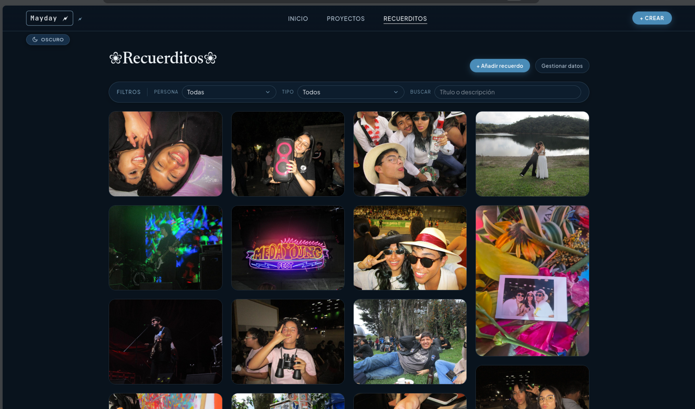
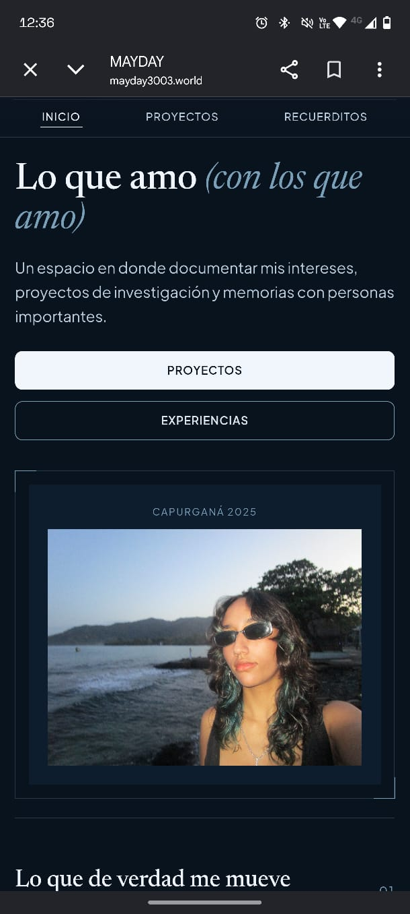
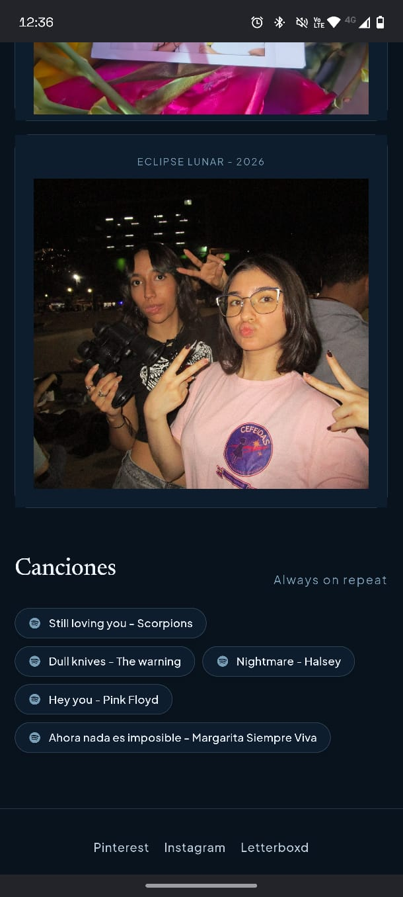
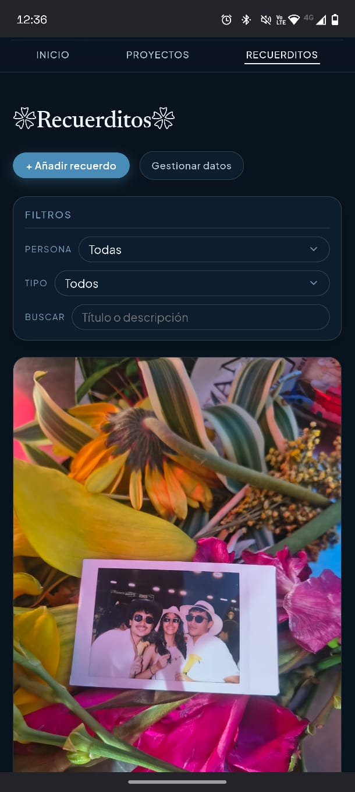

# Bitácora y recuerdos compartidos

**Sitio web:** [https://mayday3003.world](https://mayday3003.world)  

---
## 1. Descripción del proyecto 

Este es un espacio en donde espero mis amigos y yo podamos llenar con recuerdos y en donde me gustaría documentar los proyectos de investigación que hago (La mayoría también en conjunto), surge un poco de la idea de un tablero de pinterest,
en donde se puedan ver 

La página tiene 3 componentes principales:

1. **Inicio (`index.html`):** En donde hay algunas cosas que me gustan, y canciones que al darle click te llevan a spotify directamente
2. **Proyectos (`proyectos.html`):** Hay una pequeña descripción de los proyectos de investigación en los que estoy trabajando, aunque para la segunda parte me gustaría profundizar mucho más en este apartado.

3. **Recuerditos (`muro-experiencias.html`):** Un tablero donde se encuentran imágenes con diferentes categorías, descripciones y personas que estuvieron en el momento, además de una barra de filtros y búsqueda.

---

## Capturas del proyecto

### Versión en computador 

### Versión celular
*Al presionar (`Ctrl + Shift + M` o `Cmd + Option + M`), la web reconfigura el menú de navegación como si tuvieras una conexión móvil.*

  
  
  

---

## 2. Decisiones técnicas explicadas

### 2.1 CSS Grid vs. Flexbox

* **Grid:**
  * **Grilla de intereses y catálogo de fotos (`index.html`):** Usé Grid con `grid-template-columns: repeat(3, 1fr)` para que las tarjetas y las fotos mantuvieran proporciones consistentes y la sección se viera ordenada sin que se desacomodara.
  * **Panel de estadísticas (`facts-strip` en `proyectos.html`):** La estructura en 4 columnas se vuelve más inteligente en tablet y móvil, porque colapsa y se adapta sin perder legibilidad.
  * **Visor modal de recuerdos:** También usé Grid para separar la imagen de la información, porque en ese tipo de layouts se ve mucho más limpio tener dos columnas bien definidas.

* **Flexbox:**
  * **Navegación (`.site-header`, `.nav-links`):** Me sirvió para que la cabecera se alineara bien y se comportara de forma natural, aunque el contenido cambiara de tamaño.
  * **Barra de filtros y acciones (`.filter-controls`):** Aquí el Flexbox fue súper útil porque los botones, selects y buscadores tienen que ir juntos y ajustarse sin romper el diseño.
  * **Píldoras de participantes y canciones (`.pill`, `.pin-modal-chip`):** La propiedad `flex-wrap: wrap` fue clave para que los textos no se salieran del contenedor ni se vieran raros.
* **Columnas Masonry (muro tipo Pinterest):**
  * En `.visual-wall` usé CSS Columns con `column-count` para que las imágenes se acomodaran como un collage visual en vez de quedar todas rígidas en filas. Me parece una decisión muy chida porque le da ese feeling más orgánico y más “memoria viva”.

### 2.2 ¿Qué hace el JavaScript?

1. **Render dinámico del muro:** Genera todas las tarjetas de fotos desde un arreglo de objetos en memoria y las pinta en el DOM sin tener que recargar la página.
2. **Filtrado reactivo en tiempo real:** Escucha eventos `input` y `change` para filtrar por personas, tipo de recuerdo o texto, así el usuario puede buscar sin frustrarse.
3. **Gestor de ventanas modales:** Abre un detalle completo de cada recuerdo con imagen, fecha, participantes y comentarios. Además, se cierra con `Escape` o al hacer clic fuera.
4. **Formulario interactivo de subida de recuerdos:** Valida campos obligatorios, muestra errores sin usar `alert()`, procesa imágenes en local con `FileReader` y actualiza el muro al instante.
5. **Modo oscuro / claro persistente (`theme-toggle.js`):** Cambia el atributo `data-theme` en el `<html>` y guarda la preferencia en `localStorage`, así no se “pierde” cuando recargas la página.
6. **Sistema de comentarios:** Permite dejar notas en cada recuerdo, asociando el autor y la fecha al objeto en memoria, como si fuera una especie de bitácora personal.

### 2.3 Lo más difícil del proyecto y cómo se solucionó

Un problema actual es que todos los datos se guardan en el localStorage y cuando alguien guarda las cosas y lo abre desde otro dispositivo o navegador no le van a salir los cambios, intenté arreglar esto pero creo que la mejor solución fue esperar a la segunda parte del proyecto.

También a la hora del despligue, nunca lo había hecho con un dominio propio, ni con una rama que no fuera el main, entonces tuve algunos problemas básicos en configurar el DNS.

Por otra parte, en general la interactividad dentro del muro de recuerdos fue compleja y en el siguiente item se aclara, pero fue hecho en su mayoría por la IA

### 2.4 Declaración sobre el uso de Inteligencia Artificial

Se usó la inteligencia artificial en este proyecto desde varios puntos, por lo que se aclara qué hizo la IA y qué no.

Inicialmente escogí una paleta de colores he hice algunos sketch de lo que quería para la página, a partir de eso pedí a la IA que me diera una primera versión con html y css.

A partir de ahí modifiqué TODO el html, todo el texto dentro de la página es hecho por mi, además de que modifiqué el css, para cambiar elecciones de diseño.

Luego, se me ocurrieron más ideas por lo que empecé con el "tablero de pinterest" allí comencé a tener muchos problemas, por lo que la IA me ayudó a hacer gran parte de este módulo.

Además me ayudé de ella para hacer el modo nocturno y a hacer más responsive la app.

Pero la idea de la página, su estructrura general, colores y algunas funcionalidades las hice yo en su totalidad.

---

## 4. Próximas mejoras que se harían en la entrega 2 

Realmente creo que le falta mucho todavía a la página pero considero que con lo que espero agregar en el futuro será perfectamente compatible con lo que pide el curso.

Como se mencionaba, al guardar las cosas en el localStorage, no se logra el objetivo principal que es compartir fotos entre personas, pero esto con la API se logrará perfectamente.

Actualmente no hay ninguna forma de autenticación ni nada similar, se puede agregar personas y ya, pero proximamente, se tendría un proceso completo de autenticación, específicamente a ciertas partes, es decir, se podría acceder al inicio y a algunas partes de los proyectos, pero para ver algunos contenidos de proyectos y de la sección de recuerditos si se necesitaría autenticación y autorización. Esto va de la mano con que quiero tener como pines privados, es decir, que solo las personas que están en esos pines privados tengan acceso a ellos.

Por otra parte creo que la sección de proyectos tiene potencial para poder hacer una profundización y documentación de lo que se viene trabajando con los equipos, además de un material de apoyo cuando les de clase a los estudiantes de intercambio en los semilleros. Dando paso a hacerlo interactivo, para poder recibir aportes de más personas.

